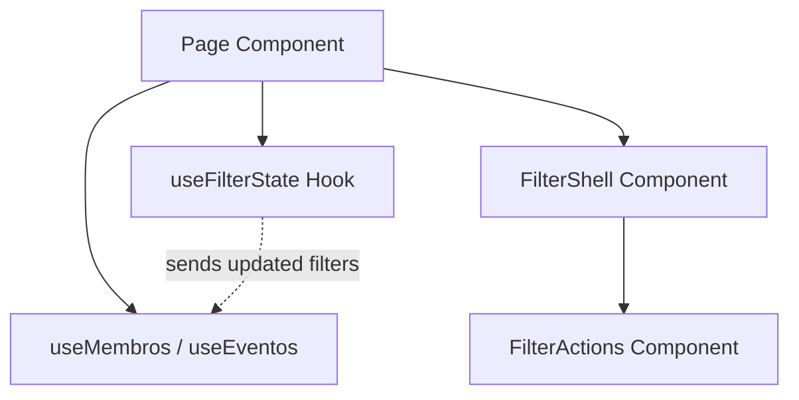

# Design de Solução ODS - Fase 4: Filtros

Este documento projeta o padrão oficial de filtros do OneElo Design System (ODS) antes de sua implementação, visando unificar a interface visual e a lógica de estado em todas as páginas com filtros.

---

## # Decisão 1: Comportamento Padrão dos Filtros

**Opção Escolhida**: **C) Híbrido**

### Justificativa:
* **Prevenção de Spam de API**: Telas que contêm campos de busca textual (como `Membros` com busca por Nome/WhatsApp, e `Agenda` com datas) exigem digitação. O disparo automático a cada tecla pressionada causaria requisições excessivas de rede e lentidão na tabela. Para essas telas, a aplicação deve ser **manual** (com botão submit).
* **Fricção Mínima para Dropdowns**: Telas constituídas puramente por filtros de seleção (dropdowns/selects, como a página principal de `Escalas` com Mês/Ano/Ministério) se beneficiam de uma navegação rápida e imediata. Para essas telas, a aplicação deve ser **automática** na mudança do campo.
* **Flexibilidade**: O `FilterShell` e o hook `useFilterState` serão projetados para suportar ambos os modos nativamente:
  * **Manual**: O formulário intercepta o submit, disparando `applyFilter` via `FilterActions`.
  * **Automático**: O hook dispara a atualização na alteração dos campos, e a tela apenas renderiza o container sem os botões de ação do `FilterActions`.

---

## # Decisão 2: Filtros Avançados no FilterShell

A tela de `Membros` requer filtros avançados (tags em formato de chips, operador combinatório AND/OR e modal para criação inline de novas tags).

### Estratégia de Acomodação:
1. **Composição em Slots/Children**: O `FilterShell` atuará como um container genérico. Filtros comuns (inputs e selects simples) serão organizados em um grid de formulário padrão. Filtros complexos (como a seção de tags) serão injetados como filhos em um bloco adicional de conteúdo.
2. **Divisão Visual Clara**: O painel de tags será renderizado abaixo do grid principal de campos de filtro, separado por uma borda superior discreta (`border-t border-gray-100 pt-3`).
3. **Desacoplamento de Modais**: O modal de criação de novas tags (`showNewTagInput`) e sua lógica de mutação de dados permanecerão declarados na página principal (ou importados de forma independente), sem poluir a responsabilidade do `FilterShell`. O painel de filtros renderizará apenas o botão gatilho "Nova Tag" de forma inline.

---

## # Decisão 3: Responsabilidades do FilterActions

O `FilterActions` será responsável por expor os botões padrão que interagem com o estado do formulário de filtros.

### Pertence ao componente:
* **Aplicar (Submit)**: Botão do tipo `submit` que dispara o envio do formulário do `FilterShell`.
* **Limpar (Clear)**: Botão de ação (tipo `button`) que aciona uma callback (`onClear`) responsável por redefinir todos os filtros locais para o valor padrão.
* **Recarregar (Reload)**: Botão secundário de ação (tipo `button` com `onReload`) visível em páginas read-only para re-executar a consulta atual na API sem limpar as seleções vigentes.

### NÃO pertence ao componente:
* **Exportar (Export)**: O disparo de exportações (PDF/CSV) é uma regra de negócio que pertence à área de cabeçalhos (`PageHeader` ou `ExportShell`), e não deve constar nos controles de filtro.

---

## # Decisão 4: Hook Compartilhado `useFilterState`

**Sim, é extremamente recomendado** criar um hook compartilhado para gerenciar a UI do formulário de filtro local, reduzindo a repetição excessiva de código.

### Estrutura do hook `useFilterState`:
```typescript
import { useState, FormEvent } from 'react';

interface UseFilterStateOptions<T> {
  initialState: T;
  onApply: (filters: T) => void;
}

export function useFilterState<T>({ initialState, onApply }: UseFilterStateOptions<T>) {
  const [formState, setFormState] = useState<T>(initialState);

  const setField = (key: keyof T, value: any) => {
    setFormState((prev) => ({ ...prev, [key]: value }));
  };

  const handleClear = (defaultClearState: T = initialState) => {
    setFormState(defaultClearState);
    onApply(defaultClearState);
  };

  const handleSubmit = (e: FormEvent) => {
    e.preventDefault();
    onApply(formState);
  };

  return {
    formState,
    setFormState,
    setField,
    handleClear,
    handleSubmit,
  };
}
```

### Justificativa:
* **Redução de Boilers**: Elimina de 5 a 10 declarações de `useState` separadas em cada página, substituindo por um único objeto.
* **Centralização de Limpeza**: Padroniza a função de "limpar", garantindo que a página resete seu estado visual e dispare a atualização da API simultaneamente.

---

## # Estratégia de Migração

### Classificação de Complexidade:

1. **Mais Simples**: `Agenda` (3 campos: select + date + date).
2. **Intermediárias**: 
   * `Membros (visualização)` (5 campos: text + selects + checkbox).
   * `Escalas (visualização)` (5 campos: selects + input número + checkbox).
3. **Mais Complexas**:
   * `Escalas (gestão)` (3 campos dropdowns com comportamento de auto-aplicação via reatividade do React).
   * `Membros (gestão)` (Filtros complexos com tags chips interativos, operador AND/OR e modal de criação inline).

### Ordem Ideal de Migração:
1. **Agenda** (Fase piloto para validar o hook `useFilterState` e os novos componentes ODS).
2. **Membros (visualização)** (Valida checkbox, selects e feedback visual de carregamento).
3. **Escalas (visualização)** (Valida o botão "Recarregar" do `FilterActions`).
4. **Escalas (gestão)** (Valida o comportamento de auto-aplicação no `useFilterState` sem renderização do `FilterActions`).
5. **Membros (gestão)** (Fase final de maior risco, englobando a composição avançada de painel de tags chips e o operador lógico).

---

## # Arquitetura Recomendada



* **FilterShell**: Inalterado ou levemente expandido para aceitar estilos. Mantém a semântica de `<form>`.
* **FilterActions**: Mantém suporte a `onClear` e `onReload` com cores e tipografia consistentes com o ODS.
* **useFilterState**: Novo hook utilitário que centraliza o estado do formulário de filtros.

---

## # Riscos e Mitigações

1. **Spam de queries na tela de Escalas (gestão)**:
   * *Risco*: Como ela aplica automaticamente os filtros de Mês/Ano/Ministério, envolver esses selects em uma tag `<form>` de submit do HTML sem prevenir o submit nativo pode causar recarregamento indesejado da página inteira.
   * *Mitigação*: Não expor botão do tipo `submit` na página de gestão de escalas. Tratar os seletores diretamente com `onChange` invocando o hook reativo e utilizando o `e.preventDefault()` padrão do `FilterShell`.
2. **Perda de flexibilidade em tags complexas**:
   * *Risco*: Tentar unificar demais a estrutura de tags de Membros no `FilterShell` e dificultar futuras modificações das regras de chips de tags.
   * *Mitigação*: Manter o array e lógica de busca de tags (`fetchTags`, `handleToggleTagFilter`) no componente de página. Injetar a listagem de chips simplesmente como `children` abaixo da grid principal do formulário.

---

## # Complexidade
**Média**. O hook unificado e a padronização das 3 páginas mais simples são rápidos e de baixo risco, enquanto o gerenciamento de tags/auto-apply exige maior atenção a loops e sincronizações.

---

## # Estimativa de Redução de Código Duplicado

* **Remoção de JSX repetido**: ~250 linhas (wrappers de container, labels de formulários e botões de ação repetidos em 5 páginas).
* **Remoção de lógica repetida**: ~120 linhas (inúmeros setters isolados e funções de limpeza redundantes).
* **Redução percentual média de código de filtros por arquivo**: **~35%**.

---

## # Plano de Implementação

### Etapa 1: Preparação de Infraestrutura
1. Criar o hook de estado `useFilterState` em `apps/web/src/hooks/use-filter-state.ts`.
2. Validar que `FilterShell` e `FilterActions` em `apps/web/src/components/app/filter-shell.tsx` estão em conformidade com as tipagens e exportados corretamente.

### Etapa 2: Refatoração Incremental
1. **Agenda**: Substituir os estados locais e botões manuais pelo hook `useFilterState` e components `FilterShell`/`FilterActions`. Testar o comportamento de busca e limpeza.
2. **Membros (visualização)**: Refatorar o formulário de filtros e incorporar o `StatCard` no lugar de estatísticas locais duplicadas (corrigindo o anti-padrão apontado na pre-análise).
3. **Escalas (visualização)**: Substituir o formulário de filtros e os botões manuais, testando a funcionalidade de recarga (`onReload`).
4. **Escalas (gestão)**: Adaptar os filtros para uso do wrapper unificado, mantendo a aplicação imediata ao alterar opções sem botões de submissão.
5. **Membros (gestão)**: Refatorar o formulário principal e acoplar a seção de tags complexa no slot inferior de layout do container.

### Etapa 3: Validação Final
1. Executar testes de integração ou validações manuais de comportamento de query.
2. Validar que o build do projeto e as ferramentas de linting não apresentem problemas.
